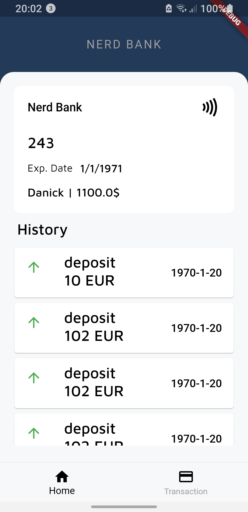
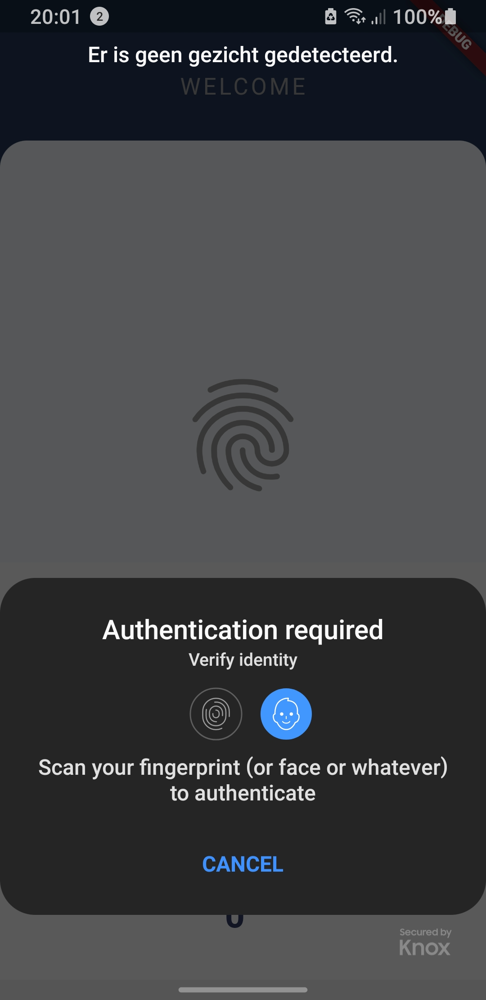

# Nerd Bank

This is the flutter app i have developed for the banking system school project. 
The app communicates with an API that i also wrote. 

Users can register with their card and code, after which they can sign in with their biometrics or pincode:

